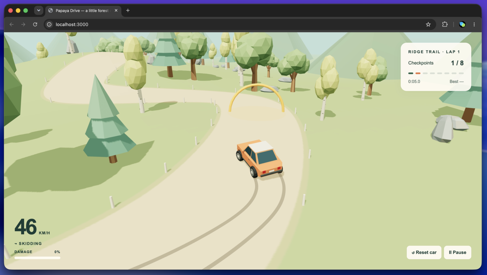

# Papaya Drive

A small Vite + TypeScript driving game with Three.js and Rapier using the Blender car, three rocks, and three trees from the adjacent asset folders.

[Play Papaya Drive](https://d2e17ltpesncil.cloudfront.net)

Run `npm install` then `npm run dev`. The game runs at `http://localhost:3000`. Build static files with `npm run build`, then preview the build with `npm start`. Run the focused driving, contact, and terrain checks with `npm test` (Node 22.13+).

- W / Up: accelerate
- A/D / Left/Right: steer
- S / Down: brake, then reverse once stopped
- Space: handbrake
- R: repair and reset the car and current lap
- Escape: pause
- Touch controls appear on phones and tablets
- Drag the scenery to orbit the camera around the car. Three seconds after release, it eases back to the chase view. This also works while paused or wrecked.

Passing a checkpoint plays a short rising chime. Fatal front impacts collapse the nose and fold the hood much more severely. Hard fatal front impacts sometimes release the nearest front wheel; it tumbles with the other debris and is refitted on reset.

Follow the eight golden checkpoint arches around the winding ridge trail. The timer starts when you accelerate. Complete a loop to start another and record your best time for this session.

Engine sound blends 12 engine and 10 exhaust recordings at measured RPMs. Adjacent recordings crossfade with small pitch adjustments; throttle adds exhaust character and gear changes briefly unload it. Levels are matched to avoid volume jumps between recordings. Tire sound follows sliding. Sound starts with your first driving input. Use Sound on/off to mute; pausing or leaving the tab silences it. Audio attribution and license details are in [audio credits](public/audio/credits.html), also linked from the pause panel.

“Cozy Drive” plays quietly on loop behind the engine and effects. Music starts with your first driving input and follows the same sound and pause controls, resuming from its current position.

The trail sits on an island with sandy beaches and a sloping seabed. Shallow water slows the car; submerging the front engine intake for 0.2 seconds floods it. A flooded engine stays off, stops checkpoint progress, and requires Restart on shore or R to recover. Jumps over water remain safe while the intake stays above the surface.

A rocky mountain with two unequal peaks rises in the island's interior, clear of the existing track and shoulders. Climbing spends forward momentum against gravity. Tire grip and chassis collisions limit steep approaches, with no mountain-specific slowdown zone. Entering water throws a spray and expanding rings; smaller ripples trail the car in the shallows. Effects pause with the game and clear on reset.

Visible axles follow the wheels through suspension travel and front-end crumpling. A detached wheel leaves a shortened shaft behind.

Crashes play layered impact sounds with volume and tone based on collision strength. Bodywork crumples around the contact point, glass cracks, and repeated or severe hits can tear off nearby bumpers, lights, mirrors and trim. Loose parts retain some of the car's momentum, tumble, bounce and settle on the terrain. Reset repairs the original model and clears debris. This is localized visual deformation with simple debris physics, rather than a full soft-body vehicle simulation.

Hard chassis impacts against trees, rocks, or terrain fill the damage meter beneath the speedometer. Damage depends on speed into the obstacle, so glancing hits are less costly. Small crashes accumulate; a full-speed head-on crash can wreck the car immediately. At 100% damage the car loses drive and brakes to a stop, and checkpoint progress and timing stop. Use Reset car, R, or Repair & restart to repair it and return to the start.

Models are in `public/models`; gameplay and Three.js rendering are in `app/game.ts`, and the HUD markup is in `index.html` with event bindings and status updates in `app/main.ts`. Movement uses Rapier rigid-body physics at 120 Hz with interpolated rendering. The road is painted onto rolling terrain, so the driving surface has no overlapping road mesh. Four raycast wheels apply suspension, steering, braking, and grip at their individual contact points. Rear-wheel drive loses traction when the rear tires lift; raised front tires cannot steer the body. Progressive bump stops absorb hard landings. Nose-first landings load the front suspension first, then swing the rear wheels down into a second impact. The same forces produce compression and settling, without a scripted upward kick or forced leveling. The car keeps angular momentum in flight. Acceleration is 12 m/s² and top speed is 95 km/h, with gentler steering at high speed. Each tire needs loaded ground contact to exert force or leave a skid mark. After a jump, each tire regains grip over 0.2 seconds while suspension contact remains immediate, allowing a brief slide as the car settles. At speed, braking while turning reduces tire grip: the car slides in its original direction as the nose turns, leaving tire marks. Release the brake or countersteer to regain control.

Terrain and route generation are in `app/terrain.ts`; the Rapier world, vehicle, and tire forces are in `app/vehicle-physics.ts`. The physics engine runs locally in WebAssembly; no backend state is required.

Deploy to AWS with `AWS_PROFILE=roventskij npm run deploy:s3`. This builds a static export, uploads the public files to the `papaya-drive-779045249836` S3 bucket in `eu-north-1`, and refreshes CloudFront distribution `E1XV070WW0P6T`. The bucket blocks public access; CloudFront serves the game over HTTPS using origin access control. Build the static files without deploying with `npm run build:static` (output: `dist/`).

The HUD uses [Fredoka](https://fonts.google.com/specimen/Fredoka), bundled locally in `public/fonts` under the included SIL Open Font License.
