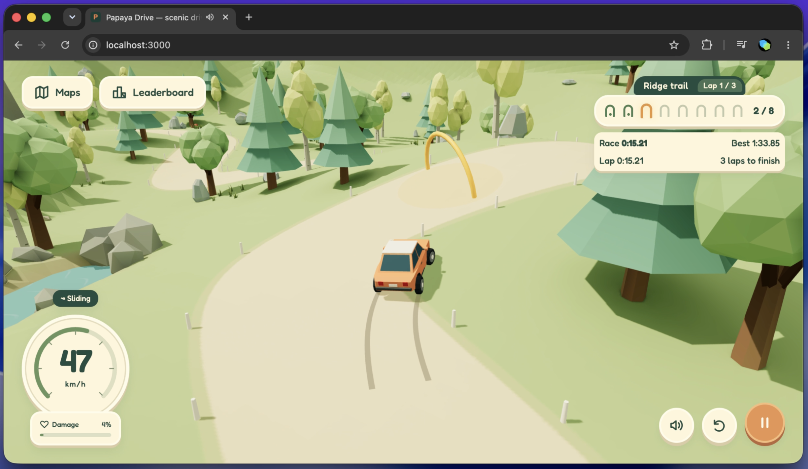
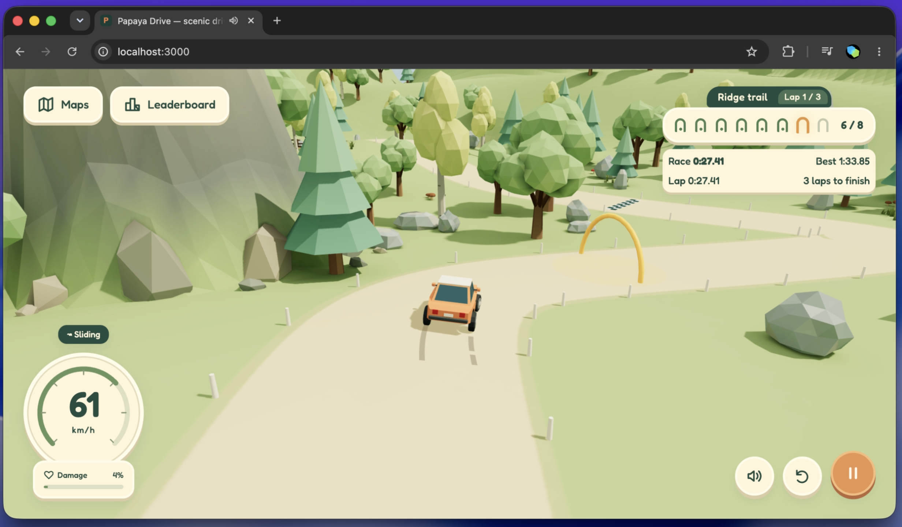
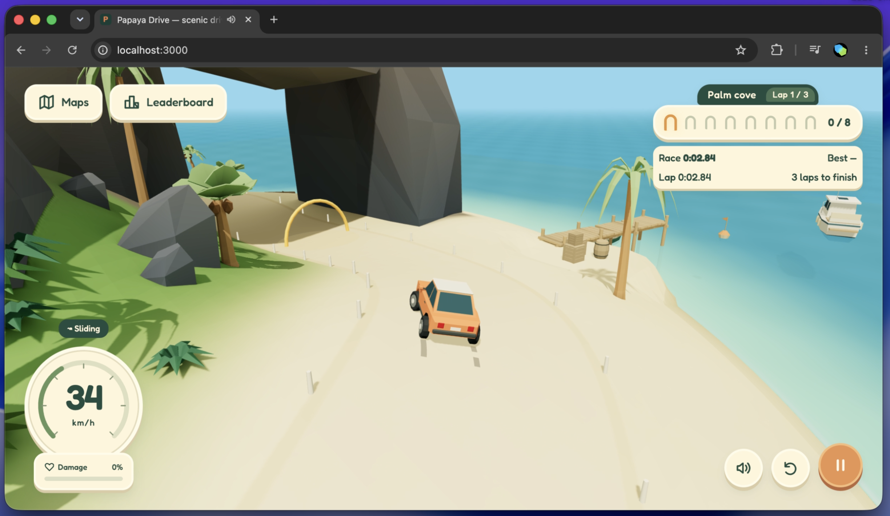
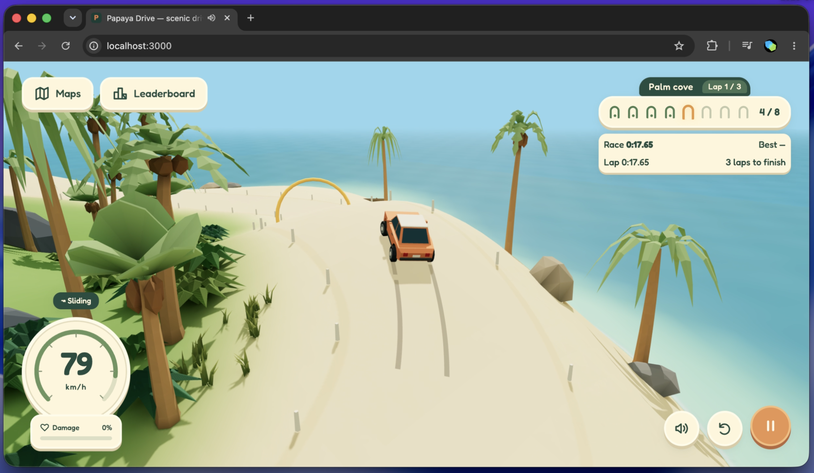

# Papaya Drive

A low-poly driving game with woodland trails, tropical beaches and a small orange car. Race three laps through the golden checkpoints and beat your best time. Each track keeps a top five in your browser.

**[Play Papaya Drive](https://d2e17ltpesncil.cloudfront.net)**

<table>
  <tr>
    <td></td>
    <td></td>
  </tr>
  <tr>
    <td></td>
    <td></td>
  </tr>
</table>

## Run locally

Requires Node.js 22.13+.

```sh
npm install
npm run dev
```

Open [localhost:3000](http://localhost:3000). Use `npm run build` for a production build, `npm start` to preview it, and `npm test` to run tests.

## Controls

| Input            | Action                      |
| ---------------- | --------------------------- |
| W / ↑            | Accelerate                  |
| A, D / ←, →      | Steer                       |
| S / ↓            | Brake and reverse           |
| Space            | Handbrake                   |
| R                | Repair and restart the race |
| Escape           | Pause                       |
| Drag the scenery | Orbit the camera            |

Touch controls appear on phones and tablets. Use **Maps** to switch between Ridge Trail and Palm Cove, and **Leaderboard** to see your best times. Times stay on this browser and device.

## Development

Built with TypeScript, Vite, Three.js, Rapier and Blender assets.

- [Development, assets and deployment](docs/development.md)
- [Shadows and lighting bakes](docs/lighting.md)
- [Audio credits](public/audio/credits.html) · [Fredoka font license](public/fonts/Fredoka-LICENSE.txt)
